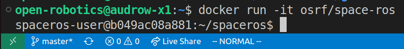
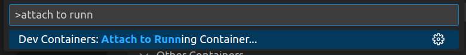
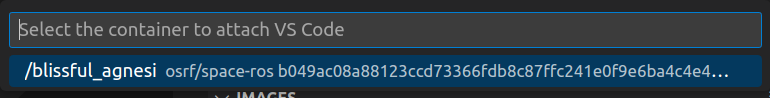
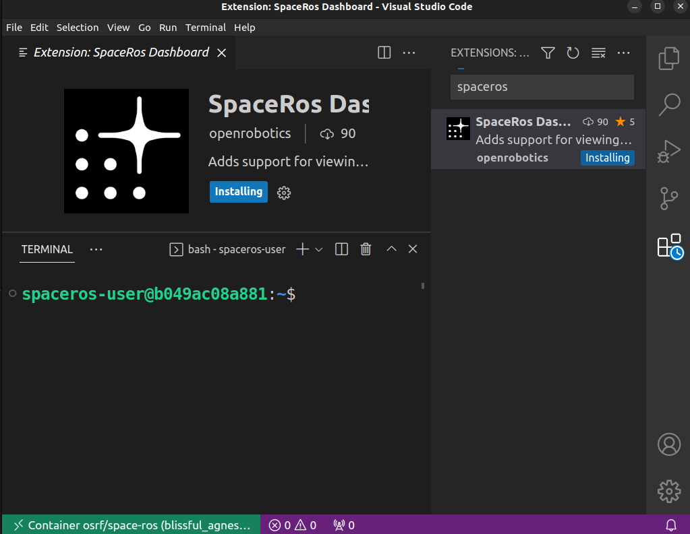

Using VSCode with the Space ROS Docker Images
=============================================

`Docker <https://www.docker.com/>`_ is a tool that allows you to run containers.
Containers are similar to are virtual machines in that they are useful for sharing reproducible software environments.
However, containers are more light weight than virtual machines since they share the kernel of the host machine.
In this How-To Guide, we'll show you how to use VSCode and Docker to work with a Space ROS Docker image.

.. contents:: Table of Contents
   :depth: 2

Prerequisites
-------------

You'll need to install the following software:

* `Docker <https://www.docker.com/>`_
* `VSCode <https://code.visualstudio.com/>`_
* `VSCode Remote Development Extension Pack <https://marketplace.visualstudio.com/items?itemName=ms-vscode-remote.vscode-remote-extensionpack>`_
* `VSCode Docker Extension <https://marketplace.visualstudio.com/items?itemName=ms-azuretools.vscode-docker>`_ (optional)

Starting a Docker Container
---------------------------

You can use your own Space ROS Docker image, or you can use a `pre-built example Space ROS Docker image from Docker Hub <https://hub.docker.com/r/osrf/space-ros/tags>`_.

.. code-block:: bash

    docker run -it osrf/space-ros:latest

.. note::

    Once you have the image pulled (happens automatically when you run the command above), you can use the VSCode Docker extension to start the container.

    .. image:: ../images/run-from-docker-extension.png

Connecting to the Docker Container with VSCode
----------------------------------------------

Once the container is running, you can use the Remote Development VSCode extension to connect to the container.
To do this, click the green button in the bottom left of VSCode.
This button is a quick way to access the Remote Development VSCode extension.

And then select "Attach to Running Container..."

.. image:: ../images/attach-to-running-container.png

Alternatively, you can press ``ctrl/cmd + shift + p`` to bring up the command palette and then type "Attach to running container" and select the "Dev Containers" option.

From there, you should select the running Space ROS container by pressing the Enter key.

.. note::

    Your container will most likely have a different name.

Once you select the container, a new VSCode window will open with the container's filesystem mounted.

.. image:: ../images/remote-window-vscode.png

You can then install the Space ROS dashboard and begin analyzing your data.

Summary
-------

In this How-To Guide, we showed you how to use VSCode and Docker to explore Space ROS Docker images.
We also showed you how to use the Remote Development VSCode extension to connect to a running Docker container.
